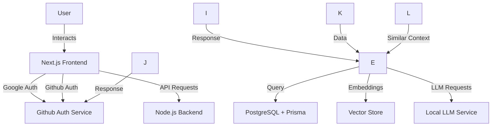

# Chatbot LLM

This project is a chatbot application utilizing a Large Language Model (LLM) with authorization and authentication from Google. The application leverages various technologies to provide a seamless and secure user experience.

## Purpose

The purpose of this chatbot is to interact with users, understand their queries, and provide relevant responses using a powerful LLM. The integration with Google for authentication ensures that only authorized users can access the chatbot, enhancing security.

## How It Works

1. **User Interaction**: Users interact with the chatbot through a user-friendly frontend built with Next.js and React.
2. **Authentication**: The application uses Google APIs to authenticate and authorize users.
3. **Backend Processing**: The Node.js backend handles API requests, queries the PostgreSQL database using Prisma, and interacts with the LLM service.
4. **LLM Service**: The LLM service processes the user queries and provides responses.
5. **Vector Store**: The application uses a vector store to manage embeddings and find similar contexts to improve response accuracy.

## Tech Stack

- **Next.js**: Frontend framework
- **PostgreSQL**: Database
- **Node.js**: Backend runtime
- **Prisma**: ORM for database interactions
- **Ollama**: LLM service
- **Vector Store**: Free vector store options like Pinecone or Weaviate
- **Google APIs**: For authentication and authorization
- **GitHub APIs**: For additional integrations
- **React**: UI library
- **TypeScript**: For type safety
- **Tailwind CSS**: For styling

## Architecture Diagram



## Installation and Usage

1. **Clone the repository**:
    ```bash
    git clone https://github.com/rothardo/chatbot-llm.git
    cd chatbot-llm
    ```

2. **Install dependencies**:
    ```bash
    pnpm install
    ```

3. **Set up environment variables**:
    Create a `.env` file and add the necessary environment variables for Google Auth, database connection, and other configurations.

4. **Run database migrations**:
    ```bash
    pnpm run migrate:postgres
    ```

5. **Seed the database**:
    ```bash
    pnpm run seed:db
    ```

6. **Start the development server**:
    ```bash
    pnpm run dev
    ```

7. **Build the application**:
    ```bash
    pnpm run build
    ```

8. **Start the production server**:
    ```bash
    pnpm run start
    ```

This will set up the chatbot application, and you can start interacting with it through the frontend interface.
