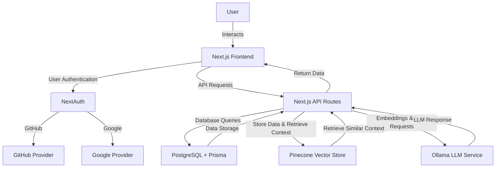

```markdown
# Chatbot LLM

This project is a chatbot application utilizing a Large Language Model (LLM) with authentication and authorization from Google. The application makes use of various technologies to provide a seamless, secure, and intelligent user experience.

## Purpose

The chatbot's purpose is to interact with users, understand their queries, and provide relevant responses using a powerful LLM. The integration with Google for authentication ensures that only authorized users can access the chatbot, enhancing security.

Additionally, this application uses your files as a **knowledge base**. It converts the contents of these files into **embeddings**, which are stored in a vector store. These embeddings help generate relevant context for the LLM when responding to queries.

## How It Works

1. **User Interaction**: Users interact with the chatbot through a user-friendly frontend built with [Next.js](https://nextjs.org/) and [React](https://reactjs.org/).
2. **Authentication**: The application uses [Google APIs](https://developers.google.com/identity) to authenticate and authorize users.
3. **Backend Processing**: The [Node.js](https://nodejs.org/en/) backend handles API requests, queries the [PostgreSQL](https://www.postgresql.org/) database using [Prisma](https://www.prisma.io/), and interacts with the LLM service.
4. **LLM Service**: The LLM service processes the user queries and provides responses via [Ollama](https://ollama.com/).
5. **Vector Store**: The application uses a vector store like [Pinecone](https://www.pinecone.io/) or [Weaviate](https://www.semi.technology/), for managing embeddings and finding similar contexts to improve response accuracy.

## LLM Integration

The LLM is trained using **your files**. These files are used as the knowledge base to generate **embeddings** that help the chatbot provide context-aware answers. The process works as follows:

- **File Upload**: You upload documents or text files to the system.
- **Embedding**: The contents of these files are converted into vector embeddings. These embeddings represent the semantic meaning of the text.
- **Vector Store**: These embeddings are stored in the vector store, such as [Pinecone](https://www.pinecone.io/) or [Weaviate](https://www.semi.technology/), allowing us to retrieve relevant context for each query.
- **LLM Context**: The chatbot queries the vector store, retrieves similar context from the stored embeddings, and sends this context to the LLM to generate more accurate and context-sensitive responses.

## Tech Stack

- **[Next.js](https://nextjs.org/)**: Frontend framework
- **[PostgreSQL](https://www.postgresql.org/)**: Database
- **[Node.js](https://nodejs.org/en/)**: Backend runtime
- **[Prisma](https://www.prisma.io/)**: ORM for database interactions
- **[Ollama](https://ollama.com/)**: LLM service
- **[Pinecone](https://www.pinecone.io/)** or **[Weaviate](https://www.semi.technology/)**: Vector store
- **[Google APIs](https://developers.google.com/identity)**: For authentication and authorization
- **[GitHub APIs](https://docs.github.com/en/rest)**: For additional integrations
- **[React](https://reactjs.org/)**: UI library
- **[TypeScript](https://www.typescriptlang.org/)**: For type safety
- **[Tailwind CSS](https://tailwindcss.com/)**: For styling

## Architecture Diagram



## Installation and Usage

1. **Clone the repository**:
    ```bash
    git clone https://github.com/yourusername/chatbot-llm.git
    cd chatbot-llm
    ```

2. **Install dependencies**:
    ```bash
    pnpm install
    ```


3. Prisma Commands

To set up the database and ensure everything works smoothly, you will need to run the following Prisma commands.

a. **Run database migrations**:
    ```bash
    pnpm run migrate:postgres
    ```
b. **Seed the database** (optional, if your project requires initial data):
    ```bash
    pnpm run seed:db
    ```

These commands will ensure that your database is set up correctly, and any necessary initial data is populated.

4. **Run the development server**:
    ```bash
    pnpm run dev
    ```

This will set up the chatbot application, and you can start interacting with it through the frontend interface.

## How the App Works

This application leverages cutting-edge technologies to deliver a conversational chatbot powered by a large language model (LLM). The integration of Google authentication ensures secure access, while the vector store allows us to build and retrieve contextual information, enhancing the accuracy of responses.

## Why I Chose These Technologies

1. **Open-Source Friendly**: Most of the technologies used in this application are open-source, giving contributors and users full freedom to customize and extend the platform.
2. **Security**: Google OAuth ensures that only authorized users can access the chatbot.
3. **Scalability**: Using tools like Next.js and Prisma provides an efficient and scalable foundation for building apps.
4. **Flexibility**: The chatbot can integrate with different LLM providers (like Ollama) or vector store solutions (like Pinecone), allowing users to customize their experience.

---

Contributions are most welcome! Please head to the [Contribution Guide](CONTRIBUTION.md) for more details on how to contribute.
```